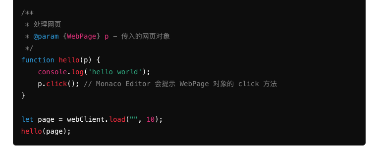

### 断点调试
1. 在代码中设置断点
   保存打上的断点信息，然后带上断点信息给后端
2. 运行调试（根据下列的断点操作 服务器给出相应的返回）
     - 逐个过程
     - 单步调试
     - 断开调试
     - 重启调试

前端需要展示的区域
1. 代码的调试输出区  DebugOutput
2. 代码的调试信息区
   - 变量信息 在调试过程中实时展示当前值  DebugVariableInfo
   - 监视区  在调试过程中你需要监控的    DebugVariableMonitor

辅助的Service
- DebugWebSocketService：获取传输断点调试信息
- DebugInfoService：同步组件的信息

需要的API
- startDebugging
- stepOver 
- stepOne 
- stopDebugging
- restartDebugging


```ts
export interface DebugInfo {
  variableInfos: Variable[];       // 当前的变量信息
  stackInfos: Stack[];             // 当前的堆栈信息
  outputInfos: Output[];           // 调试输出信息
  isOver: boolean;                 // 调试是否完成
  nextLine: number;                // 下一行要执行的行号
  breakpointHit: boolean;          // 是否命中断点
  currentFile: string;             // 当前调试的文件名或路径
  currentFunction: string;         // 当前执行的函数名
  
  executionTime: number;           // 当前执行时间（毫秒）
  memoryUsage: number;             // 当前内存使用情况（字节）
  previousLine: number;            // 上一行执行的行号
  errorInfo: string | null;        // 错误信息（如果有）
}

```

  
### 代码提示  
一般的代码提示是通过 jsdoc去声明的
支持这种： 

在内部写的变量要能支持jsdoc

代码提示来源于
1. 当前文件已经编写的已经常用库
2. 自定义声明文件.d.ts 在代码中引入


### 大纲
页面大纲根据如下结构渲染即可
```json

{
    "text": "<global>",
    "kind": "script",
    "kindModifiers": "",
    "spans": [
        {
            "start": 0,
            "length": 342
        }
    ],
    "childItems": [
        {
            "text": "Animal",
            "kind": "class",
            "kindModifiers": "",
            "spans": [
                {
                    "start": 139,
                    "length": 170
                }
            ],
            "nameSpan": {
                "start": 145,
                "length": 6
            },
            "childItems": [
                {
                    "text": "a",
                    "kind": "property",
                    "kindModifiers": "",
                    "spans": [
                        {
                            "start": 155,
                            "length": 16
                        }
                    ],
                    "nameSpan": {
                        "start": 155,
                        "length": 1
                    }
                },
                {
                    "text": "add",
                    "kind": "method",
                    "kindModifiers": "",
                    "spans": [
                        {
                            "start": 192,
                            "length": 48
                        }
                    ],
                    "nameSpan": {
                        "start": 192,
                        "length": 3
                    }
                },
                {
                    "text": "b",
                    "kind": "property",
                    "kindModifiers": "",
                    "spans": [
                        {
                            "start": 174,
                            "length": 14
                        }
                    ],
                    "nameSpan": {
                        "start": 174,
                        "length": 1
                    }
                },
                {
                    "text": "copy",
                    "kind": "method",
                    "kindModifiers": "",
                    "spans": [
                        {
                            "start": 244,
                            "length": 63
                        }
                    ],
                    "nameSpan": {
                        "start": 244,
                        "length": 4
                    }
                }
            ]
        },
        {
            "text": "dog",
            "kind": "const",
            "kindModifiers": "",
            "spans": [
                {
                    "start": 317,
                    "length": 18
                }
            ],
            "nameSpan": {
                "start": 317,
                "length": 3
            }
        },
        {
            "text": "getAge",
            "kind": "function",
            "kindModifiers": "",
            "spans": [
                {
                    "start": 103,
                    "length": 34
                }
            ],
            "nameSpan": {
                "start": 94,
                "length": 6
            }
        },
        {
            "text": "Person",
            "kind": "function",
            "kindModifiers": "",
            "spans": [
                {
                    "start": 15,
                    "length": 61
                }
            ],
            "nameSpan": {
                "start": 24,
                "length": 6
            }
        }
    ]
}
```


### 代码跳转
默认是在本文件中跳转（monaco自带）
基于模块化延伸出的问题：
- 引用的文件需要把声明注入到当前文件 提供悬浮提示、除代码报错等
- 代码跳转跨文件跳转，跳转到声明的文件处（需要模块化的支持）

这个需要保存每一个代码文件大纲结构，跳转的时候先找当前文件，然后走提供的`findSymbolDefinition`接口

```ts
export interface SymbolDefinition {
  name: string;          // 符号名称
  type: string;          // 符号类型（例如 'class', 'function', 'variable', 'interface' 等）
  file: string;          // 所在文件路径
  line?: number;         // 符号定义的行号（可选，用于文件内符号管理）
  column?: number;       // 符号定义的列号（可选，用于文件内符号管理）
  scope?: string;        // 符号的作用域（例如 'global', 'local', 'module' 等）
  visibility?: string;   // 符号的可见性（例如 'public', 'private', 'protected' 等）
  module?: string;       // 符号所在的模块名称（如果项目有模块化的概念）
  isExported?: boolean;  // 是否导出（针对 TypeScript 等支持模块导出的语言）
}


export interface SymbolDefinitionResponse {
  file: string;           // 符号定义所在文件路径
  line: number;           // 符号定义的行号
  column: number;         // 符号定义的列号
  symbolType: string;     // 符号类型（例如 'class', 'function', 'variable'）
  isDeprecated?: boolean; // 是否已弃用（如果符号已标记为弃用）
  context?: string;       // 符号所在的上下文（例如函数体、类体等的名称）
  documentation?: string; // 符号的文档注释（如 JSDoc 或 TypeDoc 注释），便于在跳转时展示
}

```


### 图片
page.click(图片)
> 目前已经实现在代码编辑器中实现插入图片，hover到图片上会显示图片的完整图片
> 

选中的图片切片哪里来？流程图片代码的编写流程是什么？

